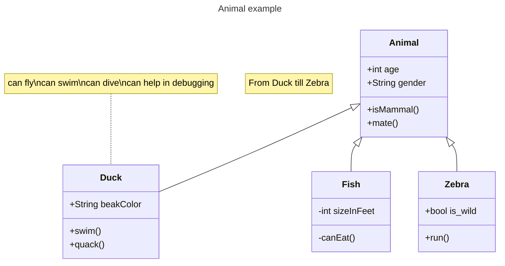

# TowerDefenseTemplate
White-Noise Towerdefense Marinus van Duijvenbode

## Product 1: "DRY SRP Scripts op GitHub"

Plaats hier minimaal 1 link naar scripts die voldoen aan de eisen van **"Don't Repeat Yourself (DRY)"** en **"Single Responsibility Principle"**.
Omschrijf hier waarom jij denkt dat je in die scripts aan deze eisen voldoet.

Bijvoorbeeld:

"ik vindt dat het lightflikker, dry en srp is omdat dat dit script compleet los is van alle andere scripten het enige dat het script doet is een 2d lamp van intersetie laten veranderen per elke frame"
[link naar script](/TowerDefense/Assets/scripts/misc/lightflikker.cs/)"*

## Product 2: "Projectmappen op GitHub"

Je commit de mappenstructuur van je unity project op github en verwijst vanuit je readme naar de root map van je project. Met een netjes en goed gestructureerde mappenstructuur en benamingen van files toon je aan dat je dit leerdoel beheerst. 

Dit is de [ROOT](/TowerDefense/) folder van mijn unity project.

Zorg dat deze verwijst naar je Develop branch.

## Product 3: Build op Github

Je maakt in Unity een stabiele “build” van je game waarbij bugs en logs eerst zijn verwijderd. Deze buildfiles upload je in je repository onder releases.  Bij eventuele afwijkingen moeten deze worden gedocumenteerd in de release. (Bijv controller nodig of spelen via netwerk etc..) 

[Release Voorbeeld](https://github.com/Marinusduif/TowerDefenseTemplate/releases/tag/1.01)

## Product 4: Game met Sprites(animations) en Textures 

De build van je game bevat textures, sprites en sprite animations(bijv particles) die op de juiste manier zijn gebruikt en zorgen voor een goede afwerking van je game.  

Plaats in je readme een animated gif van je gameplay (+- 10 sec.) waarin de implementatie van je textures en sprites goed te zien is.

## Product 5: Issues met debug screenshots op GitHub 

[Hier de link naar mijn issues](TowerDefense/Assets/forthereadme/issues/2023-10-20.png) the issue was dat de ui elementen for de damage niet verschenen ik dit kwam omdat ik de ui elementen niet gelinkt had op het script 

## Product 6: Game design met onderbouwing 

Je gebruikt een game design tool om je game design vast te leggen en te communiceren. Daarnaast onderbouw je de design keuzes ten aanzien van “playability” en “replayability” voor je game schriftelijk. 

Voorbeeld van een one page design:
 

Omschrijf per mechanic welke game design keuzes je hebt gemaakt en waarom je dit hebt gedaan.

*  **Je game bevat torens die kunnen mikken en schieten op een bewegend doel.** 

    de torens kunnen  schieten op de torens de bullets hebben een kleine homing waardoor de kans dat ze missen heel klein is, de torens hebben een lamp op hun prefap zitten die aangeeft wat de range van de torens is.

*  **Je game bevat vernietigbare vijanden die 1 of meerderen paden kunnen volgen.**  

    de enemys kunnen een route volgen omdat ik dit het beste vond pasen bij mijn game

*  **Je game bevat een “wave” systeem waarmee er onder bepaalde voorwaarden (tijd/vijanden op) nieuwe waves met vijanden het veld in komen.**

om de vier seconden spawnt er een nieuwe groep enemy's elke ronde zijn de groep vergroot met 0.75. een nieuwe ronden begint als alle enemy's dood zijn of als ze het einde hebben gehaald 

*  **Een “health” systeem waarmee je levens kunt verliezen als vijanden hun doel bereiken en zodoende het spel kunt verliezen.** 

    elke keer als een enemy het einde haalt pak je damage, als dit gebeurt verschijnt er een screen crack en als je scherm helemaal kapot is moet je opnieuw beginnen je kan 5 keer damage pakken voor dat je verliest 

## Product 7: Class Diagram voor volledige codebase 

Je brengt je volledige codebase in kaart met behulp van een class diagram. Binnen de classes hoeven geen private members te worden weergegeven. Wel alle public members (fields en methods). Ook geef je indien relevant de relaties tussen je classes weer. Je class diagram plaats je in je readme op github. Evt mag je dit doen m.b.v de [“Mermaid”](https://mermaid.js.org/syntax/classDiagram.html) tool.

## Product 8: Prototype test video
Je hebt een werkend prototype gemaakt om een idee te testen. Omschrijf if je readme wat het idee van de mechanics is geweest wat je wilde testen en laat een korte video van de gameplay test zien. 

[ 
in de video ben ik het health systeem aan het testen om te kijken om dat ik wou zien of de ui element er goed uitzagen

## Product 9: SCRUM planning inschatting 

Je maakt een SCRUM planning en geeft daarbij een inschatting aan elke userstory d.m.v storypoints / zelf te bepalen eenheden. (bijv. Storypoints, Sizes of tijd) aan het begin van een nieuwe sprint update je deze inschatting per userstory. 

Plaats in de readme een link naar je trello en **zorg ervoor dat je deze openbaar maakt**

[Link naar de openbare trello](https://trello.com/b/w60wkKSU/examen-paraphrenia)

## Product 10: Gitflow conventions

ik heb twee branches gebruikt: master en develop in develop maakte ik feature branches aan waar ik aan mijn dingen werkten en als het af was sluite ik de feature af en maakte ik een nieuwe aan om het nieuwe ding te maken.
